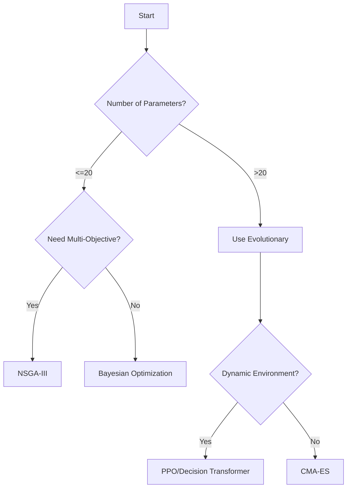

# Tuning Strategy Selection Guide

## Algorithm Comparison
| Criteria        | Bayesian Optimization (BO) | Reinforcement Learning (RL) | Evolutionary Algorithms (EA) |
|-----------------|----------------------------|-----------------------------|------------------------------|
| Best For        | Low-dim params (<20)        | Dynamic environments        | Multi-objective optimization |
| Compute Cost    | Medium                     | High                        | High                         |
| Parallelization | Moderate                   | Limited                     | Excellent                    |
| Sample Eff.     | High                       | Low                         | Medium                       |

## Decision Tree

## When to Use Which?
- **BO**: 
  - Hyperparameter tuning (learning rate, dropout)
  - Resource-constrained environments
- **RL**:
  - Neural architecture search
  - Concept drift adaptation
- **EA**:
  - Hardware-aware optimization (latency vs accuracy)
  - Dataset shift mitigation